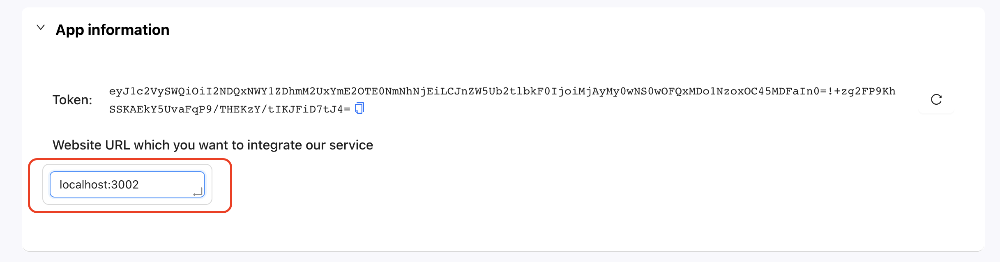

# Whitelist domain

To be able to fully integrate my service into the system, you must whitelist the domain of the website you want to integrate, this helps ensure the safety of your tokens.
Your domain can be your domain name, IP or any local address, note that the domain does not include the protocol (http://, https://) in front.

If the application you are integrating with the token we provide has a different domain than the one you provide us, we will not allow meetings on our service.

The image below indicate where you can get the setup your domain

