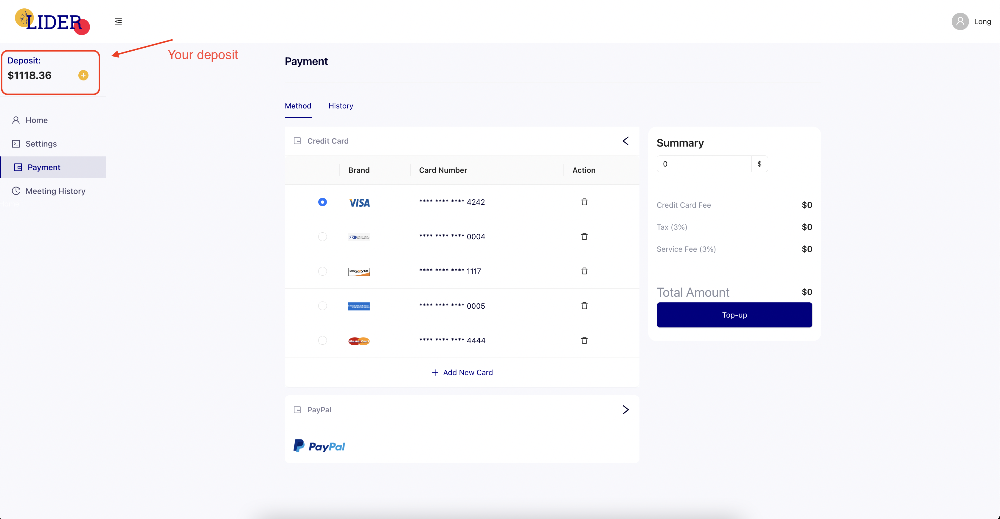

# Payment

LaaS charges for the time you use the service.
In order for users to be able to conduct meetings on your service, your application needs to top up the system.
For every minute of using the service, we will collect $ 0.02 from your account. Note that the minutes are the total meeting time of each person in the meeting, not the duration of the meeting.

We provide 2 payment methods: using card and paypal wallet, you can use debit card or credit card. We use Stripe, a major card payment company, to ensure the safety of your card usage.

With Card, you first need to add your card to LaaS Management. choose default card, every time you want to pay, i will deduct from your default card.
With PayPal, you need to log into your account for each deposit into the system.

The image below indicate where you can top up your balance

