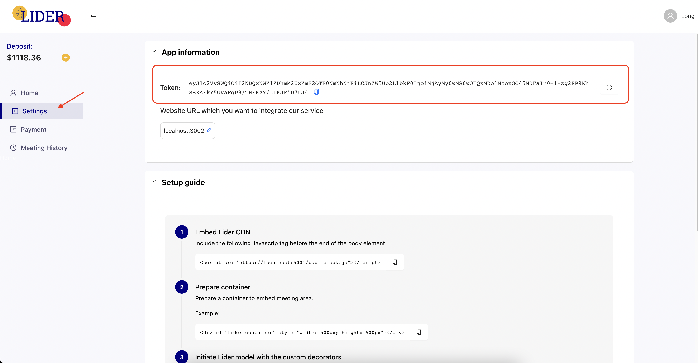

# Token

You can get the token from the Setting tab of the LaaS management website. Note that this token is a long-tern token and you don't need to worry about checking the expired token and updating it.

In case you want to revoke the token and use the new token, you can regenerate it easily. All previously generated old tokens will be invalidated.

The image below indicate where you can get the token of your app

