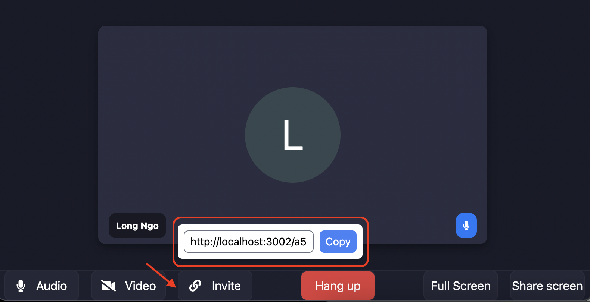

# Parameters

Function <code>join</code> have a list of required parameters and optional prameters. <br />
Below is an example and the definition of all fields

## Example

This script below is an example with all parameter can pass into join object

```JS
  lider.join({
    accessType: "public",
    token: "your_app_token",
    roomId: "roomId",
    inviteUrl: "http://localhost:3002/2451-as4r-4sa"
    user: {
      username: "username",
      avatar: "avatar",
      metadata: {
        'userId': "123123123",
      }
    },
  });
```

## Required

### roomId (string)

<code>roomId</code> is the id of the room. This field is really important and base on it, we will group your clients to the meeting room. Please ensure that you need to use an enough complex string to group your clients correctly.

### token (string)

<code>token</code> is the token string which we discuss above. This field is required and you need to pass it in initiation object to verify your app.

### user (object)

<code>user</code> is the object contain the information of your client who want to join a meeting.

#### List allowed fields in user object

> `username` **string, required**<br />
> The name of client which will show in meeting.

> `avatar` **string, optional**<br />
> The avatar of client, this field is optional and if you dont pass it in user object. we will generate automatically client avatar base of the username you provided

> `metadata` **object, optional**<br />
> The metadata of client who join your meeting. We allow you to attach user information into each meeting. It help you tracking your meeting data easier.

## Optional

### accessType ('public' | 'askToJoin')

`accessType` decide the type of meeting.

> `public`, the meeting is public and allow everyone join the meeting if they have a link. <br />  
> `askToJoin`, your client need to approved by the author of meeting to join this room.

### inviteUrl (string)

`inviteUrl` is the link of the meeting. Note that you will manage this link, Lider Iframe will show it in the meeting UI if you pass it.
A UI of this URL


### video (boolean)

`video` decide the status of client camera when join the meeting is on or off. The default value is `off`

### audio (boolean)

`audio` decide the status of client microphone when join the meeting is on or off. The default value is `off`
