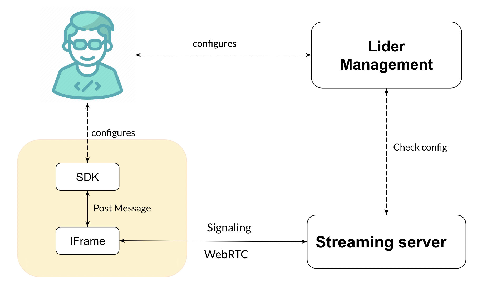

# Overview

Lider as a Service (LaaS) enables you to develop and integrate Lider Meetings functionality into your web applications.

As shown in the following diagram, the LaaS Developer Console enables you to configure and incorporate the powerful SDK to further facilitate and enhance your meetings:

Your LaaS account provides an isolated context referred to as a tenant - this is where your meetings take place and where you create your meeting room. The tenant defines the root level for the meeting room namespaces you create and use. All LaaS Meeting rooms are prefixed with the tenant ID.
